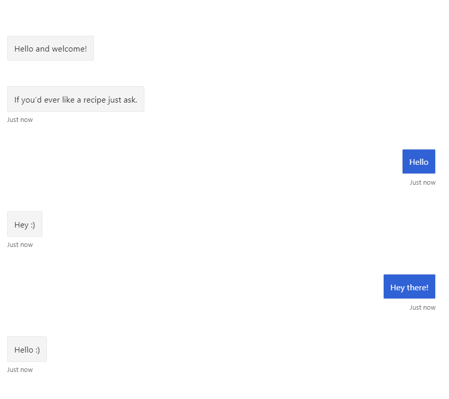
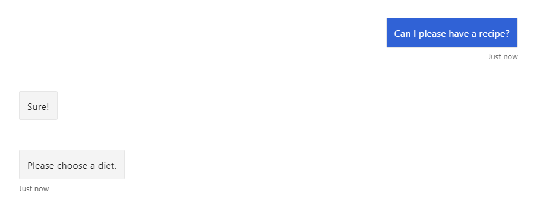
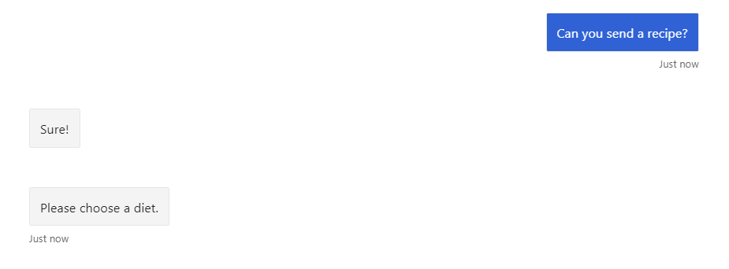
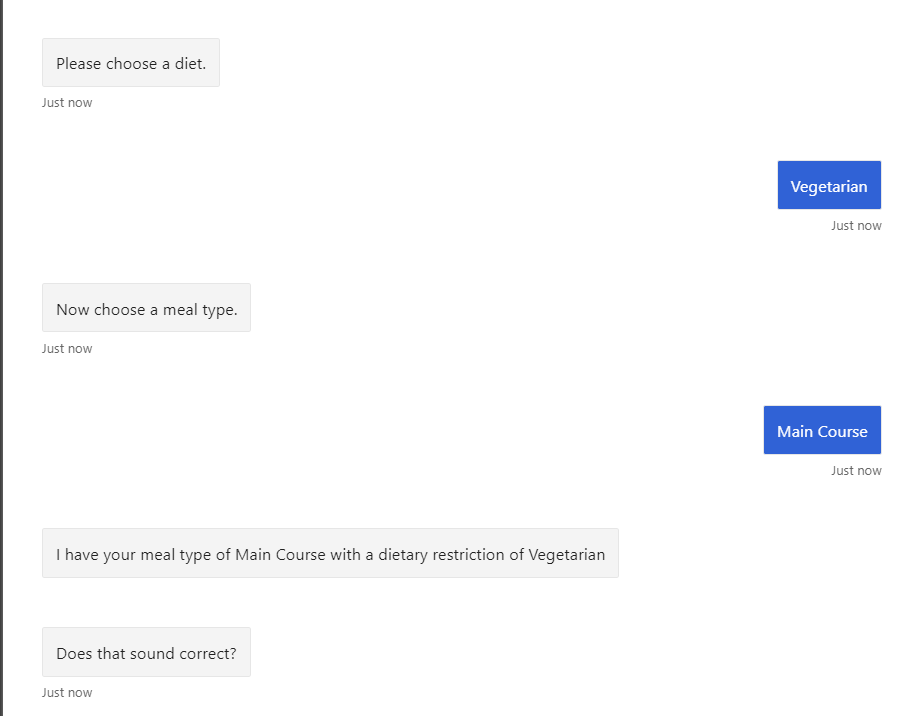
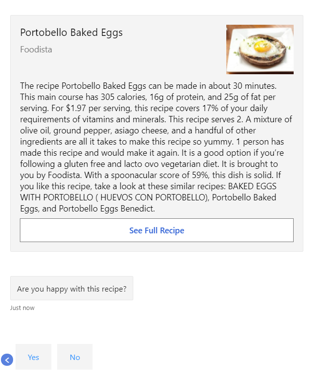
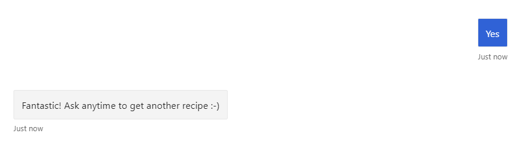

# RecipeBot

A chatbot for ordering recipes.

A chatbot built with Microsoft Azure JavaScript SDK 4. Utilises NLU with LUIS to retrieve recipes based on user choices.

NLU is used to understand intent in greetings and with recipe requests. A controlled dialog is then used to gather the clients wants. The bot interacts with the [Spoonacular](https://spoonacular.com/food-api/) API to fetch this information.

Demonstrates the core capabilities of the Microsoft Bot Framework.

## In Use
Interprets greetings...

...and recipe fetching



Asks for recipe choices. Allows the user to change selection.


And then retrieves recipes until the user is happy


Returns to neutral state


## Prerequisites

- [Node.js](https://nodejs.org) version 10.14.1 or higher

    ```bash
    # determine node version
    node --version
    ```

## To run the bot

- Install modules

    ```bash
    npm install
    ```

- Start the bot

    ```bash
    npm start
    ```

## Testing the bot using Bot Framework Emulator

[Bot Framework Emulator](https://github.com/microsoft/botframework-emulator) is a desktop application that allows bot developers to test and debug their bots on localhost or running remotely through a tunnel.

- Install the Bot Framework Emulator version 4.9.0 or greater from [here](https://github.com/Microsoft/BotFramework-Emulator/releases)

### Connect to the bot using Bot Framework Emulator

- Launch Bot Framework Emulator
- File -> Open Bot
- Enter a Bot URL of `http://localhost:3978/api/messages`